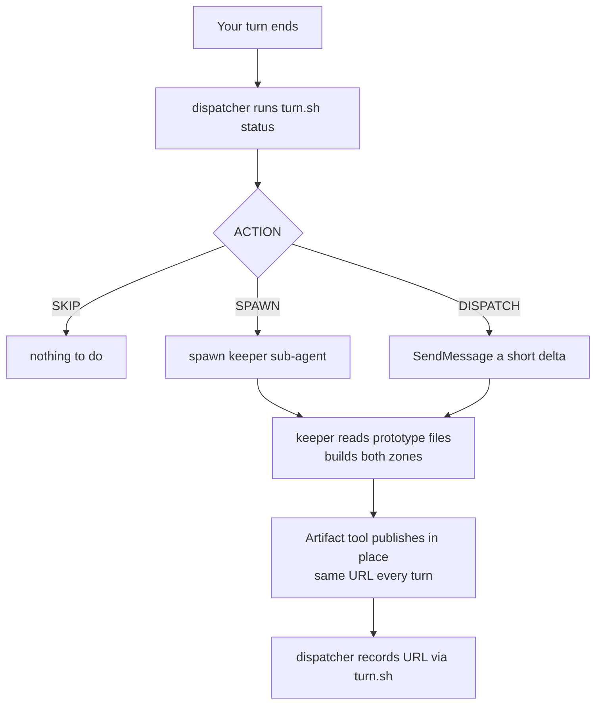

# artifact-mode

Keeps a single **living, visual artifact** on claude.ai in sync with your Claude Code session.

The page has two zones:

- **Zone A — The Work.** The prototype or project under discussion, rendered as the primary
  visualization at the top. For a web prototype, that means the thing embedded *live* in a
  sandboxed iframe. For a CLI it's a terminal panel, for a library an API surface, for a data
  pipeline a flow diagram.
- **Zone B — The Conversation.** The story of how the session got here: a timeline, decision
  cards, open questions.

If nothing showable exists yet — pure discussion, research, planning — Zone A is omitted and
Zone B becomes the whole page.

## Using it

Turn it on:

```
/kyles-got-skills:artifact-mode
```

You get one low-key confirmation, and a single link the first time the artifact is published.
After that it runs silently in the background, updating after each substantive turn. It will not
mention itself again unless you ask.

To stop it, just say so ("turn off artifact mode"). The last published URL stays valid, and
turning it back on resumes the same artifact rather than starting a new one.

Say **"conversation only"** at any point to drop Zone A permanently for the session — useful if
you'd rather not publish source code.

## How it works

Two agents split the job. The **dispatcher** is your main Claude Code session; the **keeper** is a
background sub-agent that owns the artifact and publishes it.



This design exists because of a specific constraint: a headless `claude -p` has no `Artifact`
tool, but a sub-agent spawned inside an interactive session does. The keeper stays warm across
the session, so per-turn updates are cheap deltas instead of full re-renders.

The keeper never receives your prototype's contents inline. It gets a *kind* and a list of file
paths, then reads those files itself. That keeps the messages small and the rendering current.

## State

Everything lives under `~/.claude/conversation-artifacts/`, keyed by session id:

| File | Purpose |
|---|---|
| `<id>.state.json` | active flag, keeper reference, current URL |
| `<id>.artifact.html` | the page the keeper edits |
| `<id>.url` | current artifact URL |
| `<id>.digest.md` | conversation digest, regenerated each turn |

State is deliberately on disk rather than in the model's memory. Long sessions get compacted, and
a dispatcher that "remembers" its session id would silently lose it. Because state is keyed by
session and stored outside the plugin, it also survives the plugin being uninstalled, updated, or
renamed mid-session.

## Configuration

Both are environment variables read by `turn.sh`:

| Variable | Default | Meaning |
|---|---|---|
| `AM_MIN_TURNS` | `3` | Real user turns required before the first render |
| `AM_DIR` | `~/.claude/conversation-artifacts` | Where state is written |

## Script reference

All under `skills/artifact-mode/assets/`.

**`turn.sh`** — the only script the skill calls directly.

| Command | Effect |
|---|---|
| `turn.sh on` | Activate for this session |
| `turn.sh off` | Deactivate; every later `status` returns `SKIP` |
| `turn.sh status` | Refresh the digest and print state plus an `ACTION` |
| `turn.sh mark-spawned <ref>` | Record the keeper's reference |
| `turn.sh mark-published <url>` | Record the published URL |

`status` prints `KEY=VALUE` lines and resolves to one of three actions — `SKIP` (with a `REASON`),
`SPAWN`, or `DISPATCH`.

**`digest.sh`** — turns a transcript JSONL into a narrative digest. It does two things a naive
text extract does not: it counts turns honestly, and it collapses them.

Genuine user prompts carry a `promptSource` field and no `toolUseResult`; tool results, background
task notifications and local-command echoes all arrive as user-role entries too and are filtered
out. Consecutive assistant entries are merged, because one assistant *turn* spans many assistant
*entries*. Without both fixes the turn count runs roughly 8× high — a real session measured 26
assistant / 7 user against a true 3 / 3, which made the "wait 3 turns" threshold clear during
turn one.

**`locate-session.sh`** — resolves the current session id and transcript path from the working
directory, using Claude Code's `~/.claude/projects/<encoded-cwd>/` layout.

## Privacy

Artifacts are private to your account by default, but this **publishes session content to
claude.ai on every update**, and Zone A publishes actual source code and UI. If you're working on
something proprietary, use "conversation only" or leave the skill off. It's opt-in per session and
never activates on its own.

## Cost

One Sonnet sub-agent render per substantive turn once past the threshold. Trivial turns
("thanks", "yes") are skipped. Raise `AM_MIN_TURNS` if it feels eager.

## Troubleshooting

**Nothing was published.** Run `turn.sh status` from your project directory. `ACTIVE=false` means
it was never turned on; `REASON=below-threshold` means the conversation is still too short.

**`jq: command not found`.** Install `jq` — both `digest.sh` and `turn.sh` need it.

**Wrong session picked up.** `locate-session.sh` takes the most recently modified transcript for
the current directory. Two Claude Code sessions running concurrently in the *same* directory can
bind to the wrong one.

**The artifact stopped updating after a plugin change.** The skill's asset paths are resolved when
the skill loads, so uninstalling or renaming the plugin mid-session leaves the loaded copy
pointing at a removed directory. Restart Claude Code and re-invoke. Your artifact is unaffected —
state is keyed by session, not by plugin path.

## Known limitations

**Keeper addressing.** `SKILL.md` spawns the keeper with `name: "artifact-keeper"` and dispatches
by that name. In practice agent *names* do not reliably resolve on later turns — dispatching by
the agent **id** returned at spawn does. When the name fails, the dispatcher falls back to
respawning, which still produces a correct artifact but loses the warm context the design is built
around, making each turn more expensive. The fix is to record the spawn-time agent id via
`turn.sh mark-spawned` and dispatch to that.

**Live embedding is unverified against the artifact CSP.** Zone A embeds web prototypes with a
`srcdoc` iframe. No external request is involved so it should pass, but a restrictive `frame-src`
policy could block it. As a hedge, the guidance requires every embed to be paired with a source
excerpt or description so Zone A never renders as an empty box.

**Text-only digest.** The digest keeps prose and drops tool activity, so Zone B narrates what was
*said* rather than what was *done*. Zone A compensates by rendering the actual work, but a
session's file edits and command output are not themselves part of the timeline.
